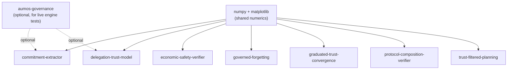

<!-- SPDX-License-Identifier: CC-BY-SA-4.0 -->
<!-- Copyright (c) 2026 MuVeraAI Corporation -->

# aumos-research — Package Guide

`aumos-research` is the monorepo for AumOS governance research companion code.
Each package corresponds to one or more academic papers and provides reproducible
simulations, experimental scripts, and result datasets. All code is MIT licensed
and intended for academic reproduction only — these are not production libraries.

> **Disclaimer:** All simulations use synthetic data and simplified dynamics.
> None of the code in this monorepo reflects production algorithms or parameters.

---

## What Is in This Monorepo

| Sub-package | Path | Paper(s) | Description |
|---|---|---|---|
| **commitment-extractor** | `packages/commitment-extractor/` | Paper 21 | Extracting and tracking commitments from agent communications |
| **delegation-trust-model** | `packages/delegation-trust-model/` | Paper 18 | Trust dynamics in agent delegation chains |
| **economic-safety-verifier** | `packages/economic-safety-verifier/` | Paper 22 | Economic safety property verification |
| **governed-forgetting** | `packages/governed-forgetting/` | Paper 5 | Memory retention policy verification |
| **graduated-trust-convergence** | `packages/graduated-trust-convergence/` | Papers 9, 25 | Trust progression convergence simulation |
| **protocol-composition-verifier** | `packages/protocol-composition-verifier/` | Papers 9, 25 | Protocol composition formal properties |
| **trust-filtered-planning** | `packages/trust-filtered-planning/` | Paper 12 | How trust levels constrain agent planning and action selection |

---

## Where to Start

Each package is independent. Start with the package that corresponds to the
paper you are reproducing.

All packages share the same structure:

```
<package>/
  src/             # Python simulation code
  experiments/     # Runnable experiment scripts
  results/         # Pre-computed result datasets
  CITATION.cff     # Citation metadata for the paper
  README.md        # Paper abstract and reproduction instructions
  pyproject.toml   # Package metadata and dev dependencies
```

---

## Cross-Package Dependencies



Packages depend only on `numpy`, `matplotlib`, and optionally `aumos-governance`
for live engine integration tests. No research package depends on another research
package.

---

## Build and Test Commands

### Per package

```bash
cd packages/<package-name>

# Install with dev dependencies
pip install -e ".[dev]"

# Run type check
mypy src/

# Lint
ruff check src/

# Run tests
pytest

# Run experiments
python experiments/run_all.py
```

### Fire-line audit (all packages)

```bash
bash scripts/fire-line-audit.sh
```

---

## Code Standards

All research packages follow the same conventions:

- Python 3.10+ with `from __future__ import annotations`
- Type hints on all function signatures — `mypy --strict` must pass
- Pydantic v2 for configuration models
- `numpy` for numerical computation, `matplotlib` for visualization
- `ruff` linting, zero warnings
- `pytest` for tests, >80% coverage
- License header on every source file:
  ```python
  # SPDX-License-Identifier: MIT
  # Copyright (c) 2026 MuVeraAI Corporation
  ```

---

## Reproducing Results

Each package's `README.md` contains step-by-step reproduction instructions.
Pre-computed results in `results/` allow comparison without running experiments.

To reproduce from scratch:

```bash
cd packages/<package-name>
pip install -e ".[dev]"
python experiments/run_all.py   # may take several minutes
```

---

## Citing This Work

Each package ships a `CITATION.cff` file with the citation metadata for the
corresponding paper. Use it with `cffconvert` to generate BibTeX or APA entries:

```bash
pip install cffconvert
cffconvert --format bibtex -i CITATION.cff
```

---

## Contributing

Research companion code can be updated to fix bugs, improve reproducibility, or
add new experiments. Specification changes (new protocols, modified semantics)
belong in `aumos-core`, not here.

See [CONTRIBUTING.md](../CONTRIBUTING.md) and [FIRE_LINE.md](../FIRE_LINE.md).

---

Copyright (c) 2026 MuVeraAI Corporation. MIT.
